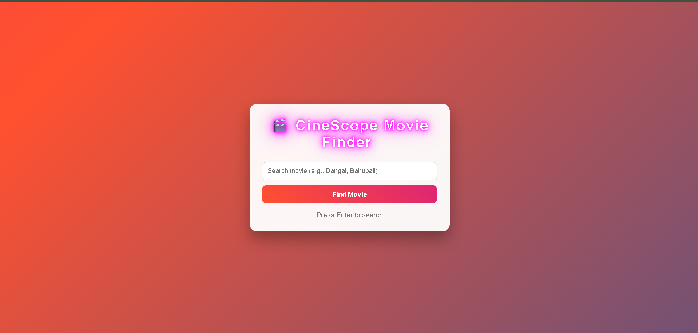
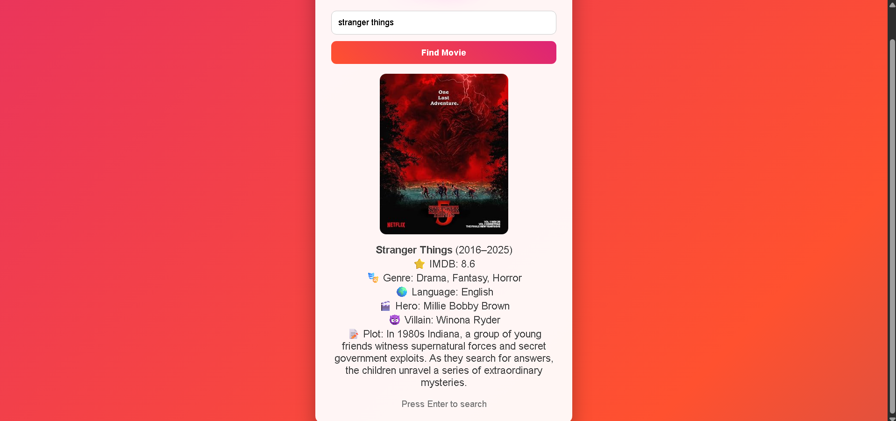

🎬 CineScope – Movie Finder

A modern and animated movie search web application that allows users to search for movies and get detailed information including poster, IMDB rating, genre, language, hero, villain, and plot.

This project uses the OMDb API to fetch real-time movie data.

🚀 Live Demo

[(Add your Netlify or GitHub Pages link here)](https://dhilip45.github.io/movie-finder/)

📌 Project Overview

CineScope is a responsive and visually attractive Movie Finder application built using:

HTML5

CSS3 (Advanced Animations + Gradient Background)

JavaScript (ES6)

OMDb API

The application allows users to search any movie (Indian or International) and displays:

🎬 Movie Poster

⭐ IMDB Rating

🎭 Genre

🌍 Language

🎬 Hero (First Actor)

😈 Villain (Third Actor – approximate)

📝 Plot Summary

✨ Features

✅ Animated Gradient Background

✅ Neon Glow Cinema Style Heading

✅ Typing Animation Effect

✅ Bounce Animation

✅ 3D Rotation on Hover

✅ Fade + Slide Card Animation

✅ Loading Indicator

✅ Error Handling

✅ Enter Key Support

✅ Responsive Design

🛠️ Technologies Used

HTML5

CSS3

JavaScript (Fetch API)

OMDb API

📂 Project Structure
CineScope-Movie-Finder/
│
├── index.html
├── style.css
├── index.js
├── screenshot/
│   ├── home.png
│   ├── result.png
└── README.md
📸 Screenshots
🏠 Homepage

(Add image here)

🔍 Movie Search Result

(Add image here)

⚙️ How It Works

User enters movie name.

JavaScript fetches data from OMDb API:

https://www.omdbapi.com/?t=MovieName&apikey=YOUR_API_KEY

Data is displayed dynamically.

Actors list is split:

First actor → Hero

Third actor → Villain (approximation)

🔑 API Used

This project uses:

🔗 OMDb API
Website: https://www.omdbapi.com/

🧠 Key JavaScript Concepts Used

Fetch API

Async / Await

DOM Manipulation

Event Listeners

Error Handling (try/catch)

Template Literals

String Manipulation

🎯 Learning Outcomes

Through this project, I improved:

API integration skills

UI animation techniques

Responsive design implementation

Clean code structuring

Git & GitHub workflow

🚀 How to Run Locally

Clone the repository:

git clone https://github.com/your-username/CineScope-Movie-Finder.git

Open project folder.

Open index.html in browser.

⭐ Future Improvements

Add Dark Mode Toggle

Add Movie Trailer (YouTube API)

Add Search Suggestions

Add Top Rated Movies Section

Improve Hero / Heroine / Villain detection
